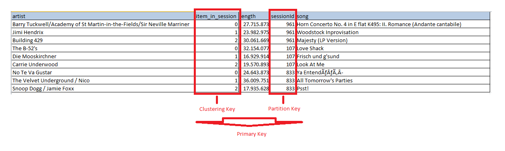
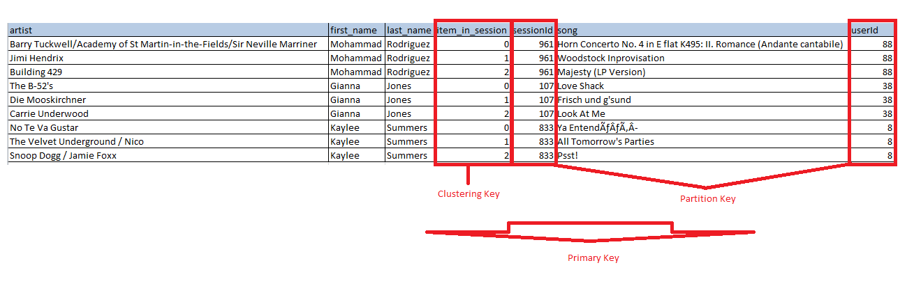
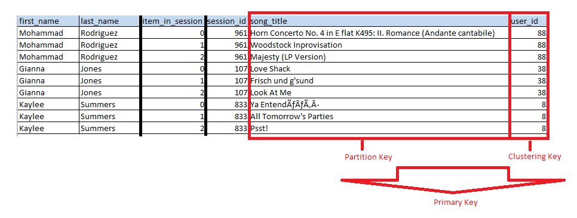

# Project: Data Modeling with Cassandra
This repository was created as part of my training on Udacity. For detailed information, you can check the https://www.udacity.com/course/data-engineer-nanodegree--nd027 link.

## Introduction
A startup called Sparkify wants to analyze the data they've been collecting on songs and user activity on their new music streaming app. The analysis team is particularly interested in understanding what songs users are listening to. Currently, there is no easy way to query the data to generate the results, since the data reside in a directory of CSV files on user activity on the app.

In this project, Sparkify keyspace was created and ETL processes were developed to meet the above-mentioned needs.

## Data 
The image below is a screenshot of what the denormalized data should appear like in the event_datafile_new.csv after pre-processing flow. This data was created by combining all other log files.
  >  
  
This is our source data for insert to table.

## Query Based Data Model Design
A data model was created to answer the following questions from above data.

  > #### 1. Give the artist, song title and song's length in the music app history that was heard during  sessionId = 338, and itemInSession  = 4
  > #### 2. Give only the following: name of artist, song (sorted by itemInSession) and user (first and last name) for userid = 10, sessionid = 182
  > #### 3. Give every user name (first and last) in my music app history who listened to the song 'All Hands Against His Own'

Based on these questions, 3 tables were created. Each question have a table.

song_info_by_session table design for question 1:
	> 

song_info_by_user table design for questions 2:
	> 

user_info_by_song table design for questions 3:
	> 

## Queries
The queries that meet the questions are as follows:

  > #### 1. Give the artist, song title and song's length in the music app history that was heard during  sessionId = 338, and itemInSession  = 4
  SELECT artist, 
         song_title, 
         length 
    FROM song_info_by_session 
    WHERE session_id = 338 AND
          item_in_session = 4
  > #### 2. Give only the following: name of artist, song (sorted by itemInSession) and user (first and last name) for userid = 10, sessionid = 182
  SELECT artist, 
         song_title, 
         first_name, 
         last_name 
    FROM song_info_by_user 
    WHERE user_id = 10 AND 
          session_id = 182
  > #### 3. Give every user name (first and last) in my music app history who listened to the song 'All Hands Against His Own'
  SELECT first_name, 
         last_name 
    FROM user_info_by_song 
    WHERE song_title = 'All Hands Against His Own'

## ETL Pipeline
Scripts were created and added to the queries.py file to create table, insert data and delete table.

By using the queries in this file in the create_table.py file, it is possible to create a keyspace and tables. For this, create_table.py file must be run before ETL processes. 

After the tables are created, the keyspace will be ready for data entry. 

In this project, the data is located in event_data folder in the main directory. There are user activity logs on the app. These all files unified to single file as event_datafile_new.csv with denormalize form on pre-process stage. 

Finally, the ready denormalize data file is insert to with the relevant column needs in the tables.

# Project Template
To get started with the project, you can find files at repository's dev branch. You can clone or download the project template files from the repository, if you'd like to develop your project locally.

In addition to the data files, the project workspace includes six files:
  * `test.ipynb` displays the first few rows of each table to let you check your database. You can use for Jupyter env.
  * `Project_1B_ Project_Template.ipynb` this notebook contains detailed instructions on the ETL process for each of the tables. You can use for Jupyter env.
  * `create_tables.py` drops and creates your tables. You run this file to reset your tables before each time you run your ETL scripts.
  * `etl.py` reads and processes files from user activity data, pre-process and loads them into tables. You can fill this out based on your work in the ETL notebook.
  * `queries.py` contains all your sql queries, and is imported into the last three files above.
  * `README.md` provides information about project.
  * `requirements.txt` contains all library for anaconda Python environment. It is best practice for running these codes.
  * `event_data` is a directory and contain sample user activity csv data.
  * `images` is a directory and contain images for readme.

## Requirements
In order for the project to run smoothly, the libraries in requirements.txt must be installed with the following command.
  > pip install -r requirements.txt
  
## Project Running
* Firstly, you must run create tables:
  > python create_tables.py

* If you didn't get any error, you can start etl process:
  > python etl.py

After, all these steps, you complete first ETL process. If you want to continuosly or scheduled running this ETL process, you can use Cron Job or Airflow methods. 

**NOTE: You will not be able to run test.ipynb and etl.py until you have run create_tables.py at least once to create the sparkify keyspace, which these other files connect to.**

### Cron Job:
https://en.wikipedia.org/wiki/Cron

### Airflow Scheduling:
https://airflow.apache.org/docs/1.10.1/scheduler.html#:~:text=The%20Airflow%20scheduler%20monitors%20all,whether%20they%20can%20be%20triggered.
https://airflow.apache.org/docs/stable/scheduler.html

 

